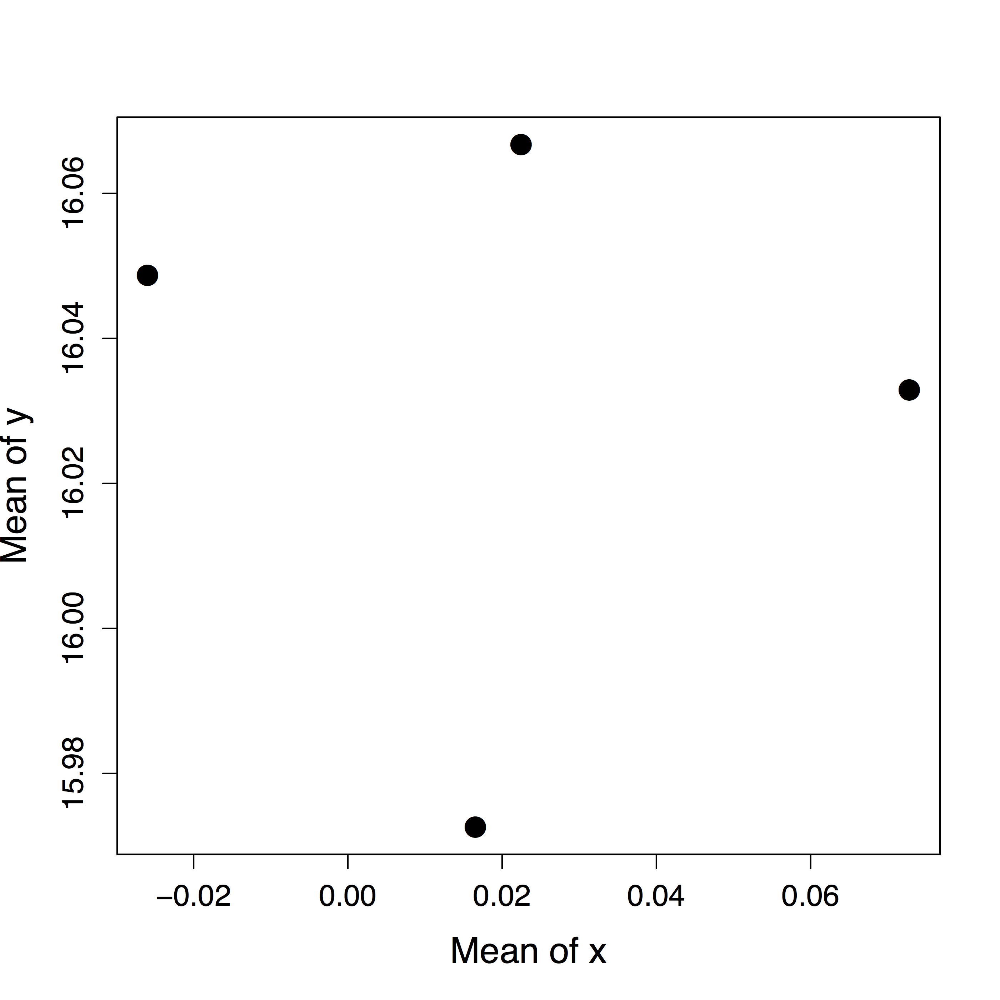

# Run the example

- Ensure that [R](https://www.r-project.org/) and [GNU make](https://www.gnu.org/software/make/) are installed, as well as the [`parallelRemake`](https://github.com/wlandau/parallelRemake) package and its [dependencies](https://github.com/wlandau/parallelRemake/blob/master/DESCRIPTION).
- Run Makefile.R in an R session to generate the [Makefile](https://www.gnu.org/software/make/) and its constituent [`remake`](https://github.com/richfitz/remake)/[YAML](http://yaml.org/) files.
- Open a [command line program](http://linuxcommand.org/) such as [Terminal](https://en.wikipedia.org/wiki/Terminal_%28OS_X%29) and point to the [current working directory](http://www.linfo.org/cd.html).
- Enter `make` into the command line to run the full workflow. To distribute the work over multiple parallel process, you can instead type `make -j <n>` where `<n>` is the number of processes.
- Verify that the generated plot `my_plot.pdf` looks similar to the provided example plot `my_plot.jpg`.
- Optionally, clean up the output. Typing `make clean` removes files generated by `make`, and `make reset` removes those files plus the [Makefile](https://www.gnu.org/software/make/) and [YAML](http://yaml.org/) files generated by `Makefile.R`.


# Details

Suppose I want to run the following workflow.

1. Generate four data frames, each with 1000 rows and columns `x` and `y`.
2. Take the column means of each data frame.
3. Plot the column means as below, where each point corresponds to a data frame.

<div style = "text-align:center">

</div>

Normally, managing this 3-task workflow would be an easy job for [`remake`](https://github.com/richfitz/remake). However, [`remake`](https://github.com/richfitz/remake) does not allow for much parallelism because it runs in a single R session. That's why I wrote `parallelRemake` to manage multiple [`remake`](https://github.com/richfitz/remake) instances with an overarching Makefile. At the end of this tutorial, you will be able to call `make -j` to distribute the work over multiple parallel processes. 

First, let's define the functions for generating data, saving column means, and plotting. I keep them in [`code.R`](https://github.com/wlandau/parallelRemake/blob/master/example/code.R), also below.

```{r}
generate_data = function(){
  data.frame(
    x = rnorm(1000), 
    y = rnorm(1000, mean = 16)
  )
}

save_column_means = function(dataset, rep){
  out = colMeans(dataset)
  saveRDS(out, paste0("column_means", rep, ".rds"))
}

my_plot = function(...){
  column_means = do.call(rbind, lapply(list(...), readRDS))
  plot(y ~ x, data = column_means)
}
```

Next, I divide the workflow among multiple [`remake`](https://github.com/richfitz/remake)/[YAML](http://yaml.org/) files. In this case, I create one [YAML](http://yaml.org/) file per dataset for tasks (1) and (2) and a single [YAML](http://yaml.org/) file for task (3). I could write these [YAML](http://yaml.org/) files by hand, but for big simulation studies, this is cumbersome and prone to human error. Below, I automate the production of the [YAML](http://yaml.org/) files with `write_yaml`.

```{r}
library(parallelRemake) 

# Number of datasets to generate with generate_data().
reps = 4

# Encode remake/YAML instructions to generate multiple datasets
# and take the column means of each dataset.
for(rep in 1:reps){ 
  dataset = paste0("dataset", rep)  
  column_means = paste0("column_means", rep, ".rds") 
 
  # Initialize YAML fields.
  fields = list(
    sources = "code.R",
    targets = list(
      all = list(depends = column_means)
    )
  )

  # Add a target to create the data.
  fields$targets[[dataset]] = list(command = strings(generate_data()))

  # Add a target to take the column means of a dataset.
  my_command = paste0("save_column_means(dataset = dataset", rep, ", rep = ", rep, ")")
  fields$targets[[column_means]] = list(command = my_command)

  # Write the YAML file for remake.
  write_yaml(fields, paste0("step", rep, ".yml"))
}

# Character string of the RDS files containing the column means.
files = paste(paste0("\"column_means", 1:reps, ".rds\""), collapse = ", ")

# Write the remake/YAML file for plotting the column means of the datasets.
fields = list(
  sources = "code.R",
  targets = list(
    all = list(depends = "my_plot.pdf"),
    my_plot.pdf = list(
      command = paste0("my_plot(", files, ")"),
      plot = "TRUE"
    )
  )
)

write_yaml(fields, "my_plot.yml")
```

Above, `strings` is a utility function that converts R expressions into character strings. Try `strings(one = readRDS("mse.rds"), two = y <- x + 1)`.

Next, I organize the [YAML](http://yaml.org/) instructions into parallelizable stages of the workflow. Within each stage, the steps can be run in separate parallel processes. 

```{r}
stages = list(
  data = paste0("step", 1:reps, ".yml"),
  plot = strings(my_plot.yml) 
)
```

Be sure that every element of `stages` is named (in this case, I use `data` and `plot`), and be sure that `c(names(stages), unlist(stages))` has no duplicates. In `stages`, I include the `.yml` extensions of the [YAML](http://yaml.org/) files previously generated, but you have the option to omit them. Duplicates are checked after the `.yml` extensions are removed. 

This organization of steps into stages is encoded in an overarching [Makefile](https://www.gnu.org/software/make/) produced by `write_makefile`.

```{r}
write_makefile(stages, begin = c("# This is my makefile.", "# Variables..."))
```

Above, `begin` is an optional character vector of lines to prepend to the [Makefile](https://www.gnu.org/software/make/). In this way, I can configure my workflow for a [Slurm](https://en.wikipedia.org/wiki/Slurm_Workload_Manager) or [PBS](https://en.wikipedia.org/wiki/Portable_Batch_System) cluster or simply add comments.

With a [Makefile](https://www.gnu.org/software/make/) in hand, I can easily run the whole workflow. First, I open a [command line program](http://linuxcommand.org/) such as [Terminal](https://en.wikipedia.org/wiki/Terminal_%28OS_X%29) and point to the [current working directory](http://www.linfo.org/cd.html). Then, I can manage the workflow by typing commands.

- `make` runs the full workflow, only building targets that are out of date.
- `make -j <n>` is the same as above with the workflow distributed over `<n>` parallel processes. Similarly, you can append `-j <n>` to any of the commands below to activate parallelism.
- `make data` just makes the datasets. The [Makefile](https://www.gnu.org/software/make/) knows to do this because `data` is in `names(stages)`.
- Similarly, `make plot` ensures the datasets are up to date and then makes the plot.
- `make clean` removes the files generated by `make`. If some of your files are produced by side effects, `make clean` might not remove them. In that case, those files may not be rebuilt when the dependencies change, so you should probably fix your [YAML](http://yaml.org/) files.
- `make reset` runs `make clean` and then removes the [Makefile](https://www.gnu.org/software/make/) and all its constituent [YAML](http://yaml.org/) files.

# Warning

The [`remake`](https://github.com/richfitz/remake) package mostly focuses on managing R code in a single R session. As an upshot, editing R code triggers rebuilds, but editing intermediate files by hand only triggers later rebuilds. Thus, all your data and output should be generated by code and then left alone. See the [posted issue](https://github.com/richfitz/remake/issues/87) to see this phenomenon reproduced.


